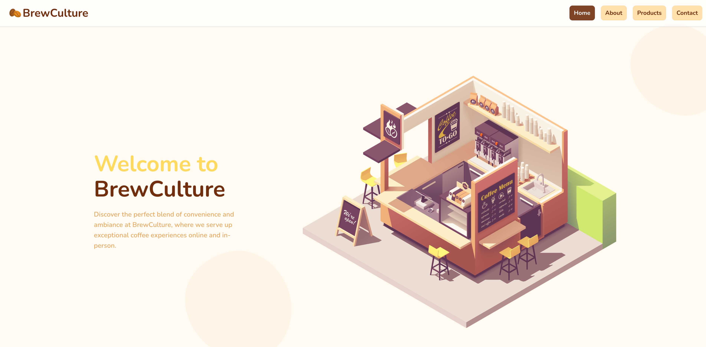
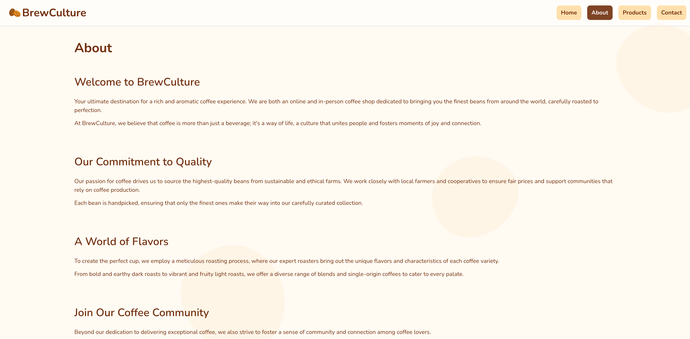
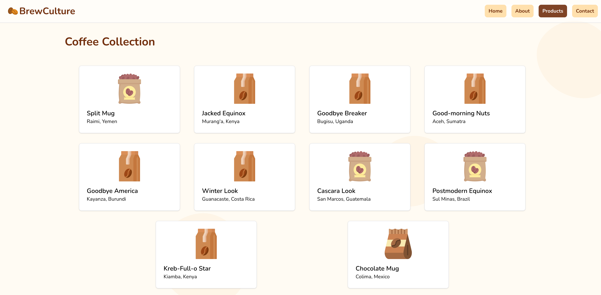
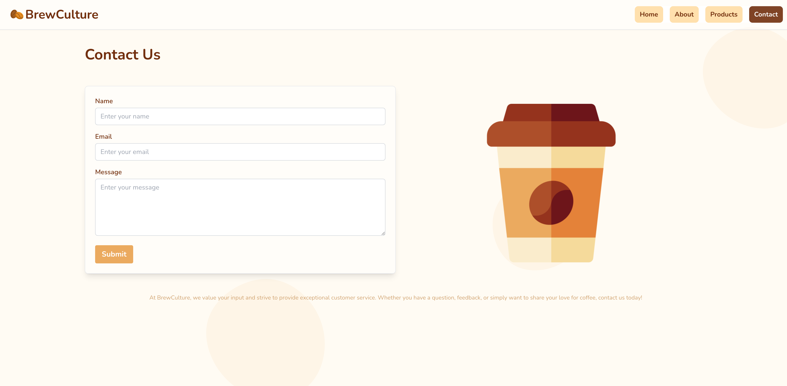

# ☕ BrewCulture

[Click for Live Demo](https://brewculture.netlify.app/)

Discover the perfect blend of convenience and ambiance at BrewCulture, where we serve up exceptional coffee experiences online and in-person.

## 📄 User Instructions

Browse through the website and enjoy the coffee experience! When you would like to refrsh the list of products shown, click on the refresh button on the bottom left of the products page.

## ⚒️ Frameworks
️
MVC - Angular📝
CSS - Tailwind
VCS - Git
Website/Domain Hosting - Netlify

## 🧪 CI/CD

This project uses GitHub Actions for CI/CD. There is currently one workflow that is triggered on push or pull request to any branch within the repository. This workflow is a simple test that runs `yarn`, `ng lint` and `ng test` to ensure that the required dependencies are installed, the code is linted and tested.

## ☁️ Deployment

The live version of this website is hosted on Netlify!

## 📷 Gallery

## 📖 Developer Content

The following was auto-generated by the Angular CLI.

### Description

This project was generated with [Angular CLI](https://github.com/angular/angular-cli) version 16.1.3.

### Development server

Run `ng serve` for a dev server. Navigate to `http://localhost:4200/`. The application will automatically reload if you change any of the source files.

### Code scaffolding

Run `ng generate component component-name` to generate a new component. You can also use `ng generate directive|pipe|service|class|guard|interface|enum|module`.

### Build

Run `ng build` to build the project. The build artifacts will be stored in the `dist/` directory.

### Running unit tests

Run `ng test` to execute the unit tests via [Karma](https://karma-runner.github.io).

### Running end-to-end tests

Run `ng e2e` to execute the end-to-end tests via a platform of your choice. To use this command, you need to first add a package that implements end-to-end testing capabilities.

### Further help

To get more help on the Angular CLI use `ng help` or go check out the [Angular CLI Overview and Command Reference](https://angular.io/cli) page.
